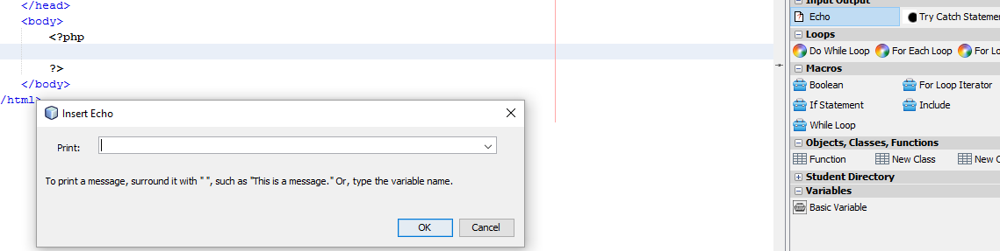

#Table Of Contents
  <ul>
    <li><a href="#What-is-this">What Is This</a></li>
    <li><a href="#Prerequisites">Prerequisites</a></li>
    <li><a href="#Quick-Start">Quick-Start</a></li>
    <li><a href="#About">About</a></li>
    <li><a href="#Screenshot">Screenshot</a></li>
    <li><a href="#Licensing">Licensing</a></li>
  </ul>
<a name="What-is-this"><h1>What Is This</h1></a>
  
A plugin for netbeans to assist users in learning PHP

<a name="Prerequisites"><h1>Prerequisites</h1></a>
  
The following software must be present on your computer:
  <ul>
    <li><a href="http://www.oracle.com/technetwork/java/javase/downloads/index.html"> Java SDK 7+ </a></li>
    <li><a href="https://netbeans.org/downloads/">Netbeans 7.1+</a> (lesser versions are likely to work but are untested)</li>
  </ul>
<a name="Quick-Start"><h1>Quick Start</h1></a>
<ul>
  <li>Clone this repo</li>
  <li>Open up Netbeans and navigate to and open the directory containing the downloaded code</li>
  <li>With PHPsourceFilePalette selected in netbeans, click the run button</li>
  <li>A new instance of netbeans opens up. From here, you can select New Project->PHP->PHP Application</li>
  <li>Select any of the other menu options that you would like when selecting the rest of the new project options</li>
  <li>You will now be presented with a blank project (with some HTML boilerplate). You also now have a palette on the left hand side of your screen with draggable PHP commands
</ul>
<a name="Author"><h1>Author</h1></a>
  
This project was written as an assignment for a programming with objects course at Quinsigamond Community College.
  This project was authored by William Jellesma. 

<a name="Screenshot"><h1>Screenshot</h1></a>

<a name="Licensing"><h1>Licensing</h1></a>

This Project is licensed under the <a href="http://choosealicense.com/licenses/mit/">MIT License</a>

